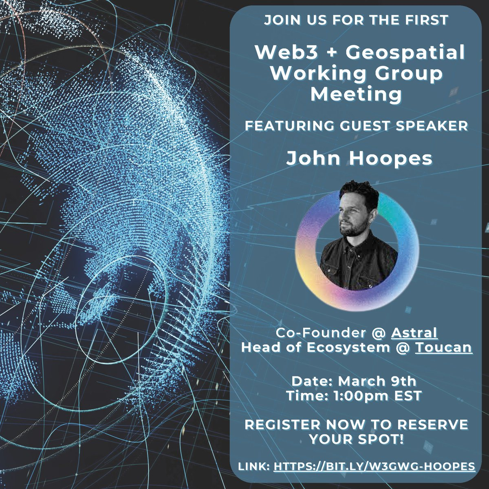

******
dGWWG
******

.. post:: 
    :tags: UMD, Web3, Geospatial
    :author: The EASIER Data Initiative

**The Decentralized Geospatial Web Working Group**

| The working group aims to bring together folks interested in decentralized applications of geospatial data and technology. It will convene to highlight opportunities and challenges towards a decentralized geospatial web ecosystem. It will feature a series of speakers, updates from projects, and open discussions. The meetings are open to all so please join us and feel free to reach out if you would like to contribute.

-----

Events
=========

First Decentralized Geospatial Web Working Group Meeting
*********************************************
**Featuring Guest Speaker John Hoopes**

| Please join us for the inaugural Decentralized Geospatial Web Working Group (dGWWG) meeting!
| 
| The meeting will be hosted by The EASIER Data Initiative - a collaborative project between the University of Maryland Department of Geographical Science and the Filecoin Foundation for the Decentralized Web.
| 
| After introducing the dGWWG and The EASIER Data Initiative, the meeting agenda will consist of a brief presentation by guest speaker John Hoopes, followed by Q&A and open discussion about opportunities and challenges of the nexus of web3 and geospatial data and technology.
| 
| John is a co-founder at Astral and Head of Ecosystem at Toucan and will be sharing his insights on recent developments in web3 and geospatial technology, and how these can be used to create innovative applications.
| 
| Don't miss this opportunity to connect with other professionals in the field and learn from one of the leading experts in the area!
`Join us! <https://bit.ly/W3GWG-Hoopes>`_
