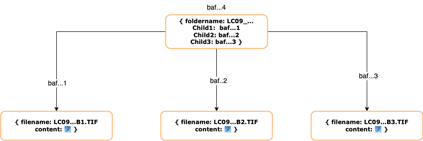

## Introduction

Web3 is an exciting and rapidly evolving space for geographic information. This post explores how EASIER uses STAC, Filecoin, and IPFS to store, retrieve, and analyze geospatial data.

## What do CIDs have to do with Geographic Data?

When a piece of data is stored in a blockchain-managed, decentralized storage system such as [Filecoin](https://filecoin.io/ "Filecoin Homepage"), a cryptographic hash is generated that uniquely identifies the data. This hash is known as the [CID](https://docs.ipfs.tech/concepts/content-addressing/#what-is-a-cid "What is a CID IPFS Doc") (Content Identifier)

Instead of folders and files, content is hierarchically organized through a [Merkle Dag](https://proto.school/merkle-dags "Protoschool Tutorial on Merkle Dags"). For example, a Landsat scene might be represented this way, with the top-level folder name acting as the root and each .TIF within the Landsat scene as a child node. Each node is uniquely identified by a CID starting with `baf`, which is how all V1 CIDs begin.  

[Learn more about content-based addressing vs location-based addressing on ProtoSchool](https://proto.school/content-addressing/03 "Protoschool Doc on content addressing")

## How does IPFS help you find Geographic data on Web3?

If you would like to share these files with others, IPFS is an excellent choice. [IPFS](https://docs.ipfs.tech/concepts/what-is-ipfs/ "IPFS Docs - What is IPFS") is a distributed system for storing and accessing files, websites, applications, and data.

Instead of accessing content by location:

e.g.

domain.com/cat.png

You search for content via CID where `ipfs://<CID>` resolves to content that can live anywhere on the IPFS network.

Content is accessed on IPFS through an [IPFS Gateway](https://docs.ipfs.tech/concepts/ipfs-gateway/#gateway-providers "IPFS Doc on IPFS Gateways"). For example, the Chromium browser, Brave, has [native IPFS support](https://brave.com/ipfs-support/ "Brave Doc on IPFS Support"). Type `/ipfs/<CID>` into the address bar, and you’ll access data via IPFS!

## Locating Geographic Data via CID within the STAC specification

We have gone one step further and have shown that we can successfully describe and retrieve geospatial data from IPFS by including CIDs in STAC metadata.

[STAC](https://stacspec.org/en "STAC Spec Homepage") is a specification that enables a common language to describe geospatial information, so it can more easily be worked with, indexed, and discovered. We leverage STAC's [alternate assets extension](https://github.com/stac-extensions/alternate-assets "STAC alternate-assets Extension") to add CIDs to Landsat 9 scenes.

     "alternate": {
       "IPFS": {
         "href": "ipfs://<CID>"
       }
     }

By specifying an asset's CID, an alternate `href`, anyone can share spatial data that is content-addressed and referenced on IPFS in their STAC metadata. This data could live on Filecoin, another web3 storage platform, or an IPFS node.

## Conclusion

We demonstrated that it's possible to enrich the STAC specification with IPFS CIDs to retrieve geographic data from decentralized storage systems. With CIDs, the source data can be fetched from storage providers in the [Filecoin](https://filecoin.io/ "Filecoin Homepage") ecosystem and any node on the IPFS network.

In our next blog post, we will demonstrate how easy it is to perform a typical geographic workflow using decentralized data and an IPFS-enriched STAC server.

***

John Solly - Geospatial Developer