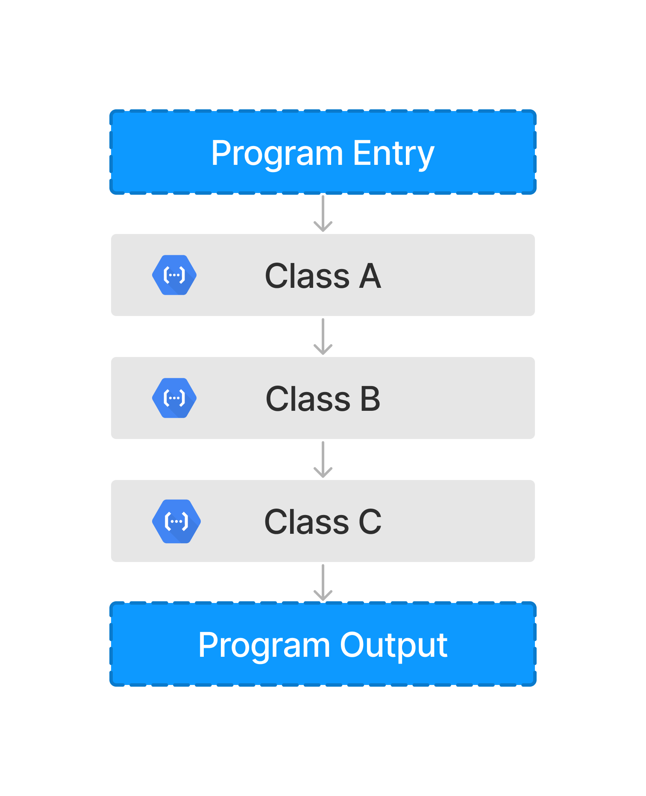
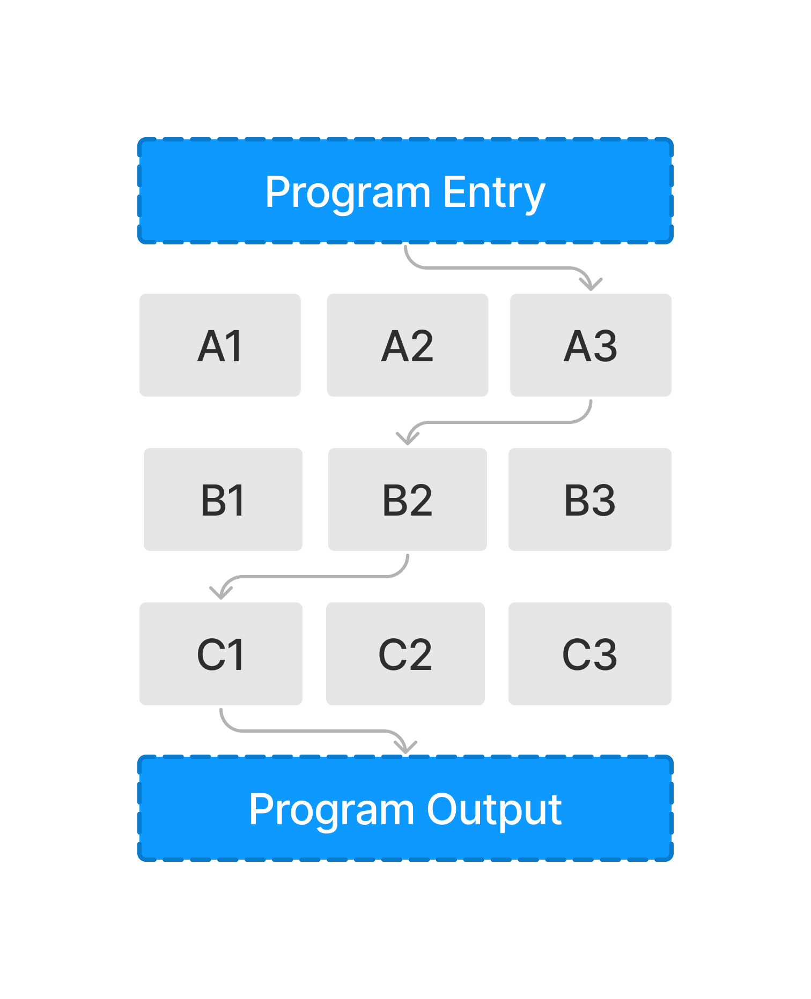
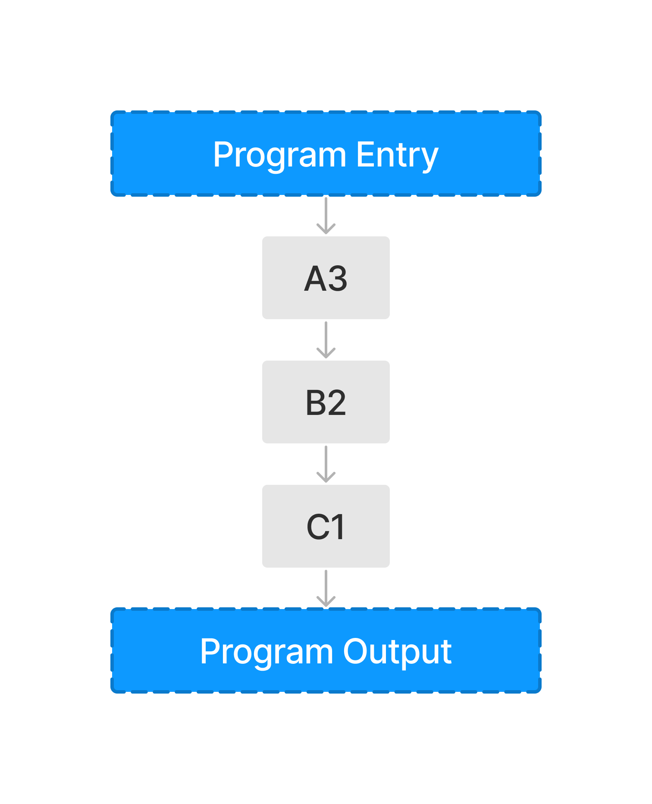
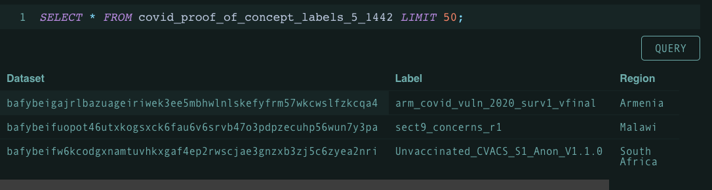
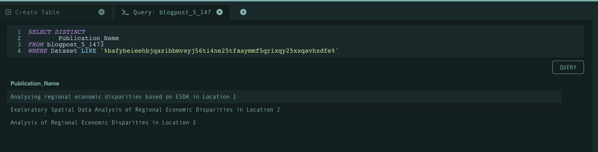
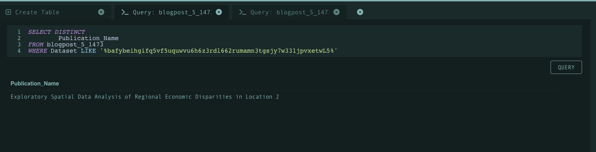

# A New Method to Code Citation

For scientific publishing, being able to share artifacts such as data and code is imperative to illustrate a methodology in practice and support the validity of findings through replicability.

Unfortunately, many publications aren't quite reproducible (even with good faith efforts) due to stale/broken links, changing code versions, and lack of reporting detail. Additionally, while it is possible to query a publication or code file for keywords, there isn’t a mechanism to query publications by associated code contents or to search for unique chunks of code. As the EASIER Data Initiative continues to explore the harmony between geospatial data and web3, the team has explored broader opportunities for advancing open science. This post will explore how content-addressing and the interplanetary file system (IPFS) may benefit researchers and developers through code atomization.

# Code Atomization

*Code atomization* refers to breaking down a program into smaller, manageable components. An atomized program enables more manageable testing and debugging as one points toward only the components that are used.

# Atomization Illustration

A typical program is composed of classes as illustrated above. When atomized, these classes can be broken down into the methods/functions that compose the classes of the program. The visual below highlights this result.

We can take this process one-step further and only extract the components used within a workflow (illustrated below). In the scope of this blog post, we will explore how this methodology will reshape the way we query publications and analyze production code as developers.

# Use Case 1 (Publications)

Code atomization opens the door for concrete code/function querying over a set of publications. By atomizing programs, authors are able to assign functions, methods, and classes within their code artifacts respective content identifiers (CIDs). And by doing so, the process of querying publications by code is simplified through searching for specific CIDs. Referencing code in-text becomes easier as one is able to cite a CID as opposed to designating a block of text for a segment of code. Moreover, a dictionary of CIDs referenced may be maintained in a glossary like fashion to maintain organization. To illustrate this better, let's take a look at the following example table created on [Tableland](https://tableland.xyz):

Existing publication explorer/repository infrastructure may store metadata associated with each publication such as author names, publication names, etc. As mentioned before, maintaing a dictionary/manifest of program function CIDs will enable easier querying. To demonstrate this, we can take some arbitrary function CID ([bafybeieehbjqazibbmvsyj56ti4ne25tfaaymmf5qrixqy25xxqavhzdfe](https://bafybeieehbjqazibbmvsyj56ti4ne25tfaaymmf5qrixqy25xxqavhzdfe.ipfs.w3s.link)) and see whether or not the function at hand was used within a publication through a query as demonstrated below:

As shown above, the query highlights that all three publications utilized the function associated with the CID. Note that Tableland is a decentralized relational database therefore queries are more complex than just pasting a simple string (however this may illustrate how a query is ran on the backend of an web-app).

The visual above highlights another query where only one publication utilized a CID associated with some arbitrary function. All things considered, it's clear to see many benefits with a code atomization workflow for publications:

1. Queries are simplified - code blocks are replaced with CIDs.
2. Easier code comparison between publications - finding canonical program functions becomes easier.

Code atomization also enables workflows to be extracted from intricate programs. An example workflow to achieve this goal would be profiling a workflow from a python program and then uploading the functions used (according to the program profile) to IPFS. In doing so, an array of CIDs are then able to be referenced to point to different parts of the program and also share a timeless characteristic such that updates to any code does not affect the snippets stored. This process creates an opportunity to easily compare and contrast two publications/workflows. By comparing a set of CIDs used by two (or more) publications, an audience will be able to determine what practices are more common.

# Use Case 2 (Software Development)

Being able to analyze statistics regarding CID uploads/retrievals creates a powerful opportunity for software developers, namely those who build and maintain libraries. These analytics enable developers to determine what components of their projects are most used and therefore (in a subjective sense) more valuable to their end users. In turn, developers will be more aware of what to change and how to communicate changes in a more organized fashion.

Services such as [Pinata](https://www.pinata.cloud) make this possible through [Cloudflare](https://www.cloudflare.com) analytics. The service is also experimenting with an [in-house solution](https://pinnie.typeform.com/to/fxNLtCfo) to CID analytics. Regardless, this features achieves the previously mentioned ability to gather statistics regarding CIDs on IPFS. A developer may be able to manage their atomized component CIDs and see which are being pulled/pushed more often than others. 

# Conclusion

Considering previous blog posts, we now see how IPFS is powerful technology that benefits communities beyond just GIS and research. The ability to refer to content via CID addresses many problems and hurdles faced by publications and developers.

In our next blog post, we will demonstrate a proof-of-concept that follows atomizing a python workflow and assigning components CIDs on IPFS.
