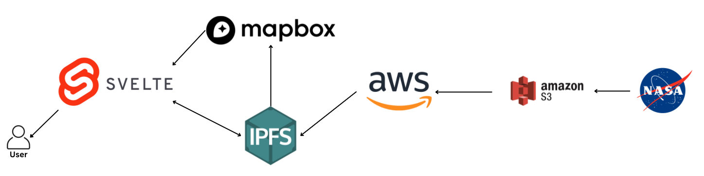
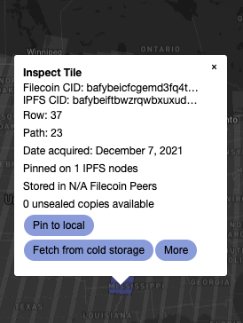
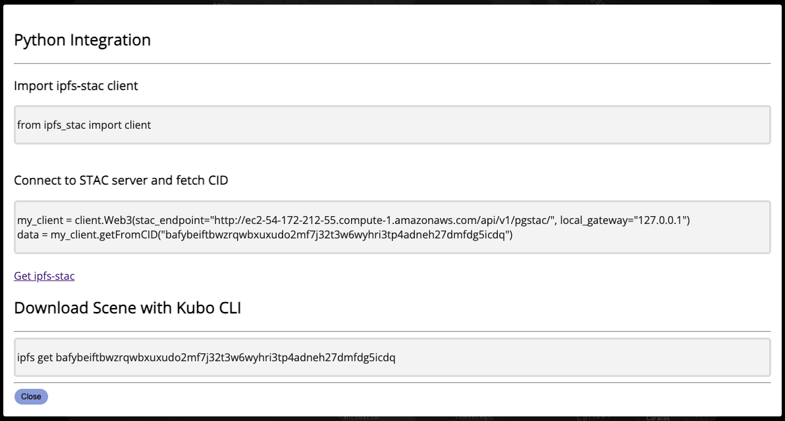
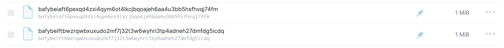
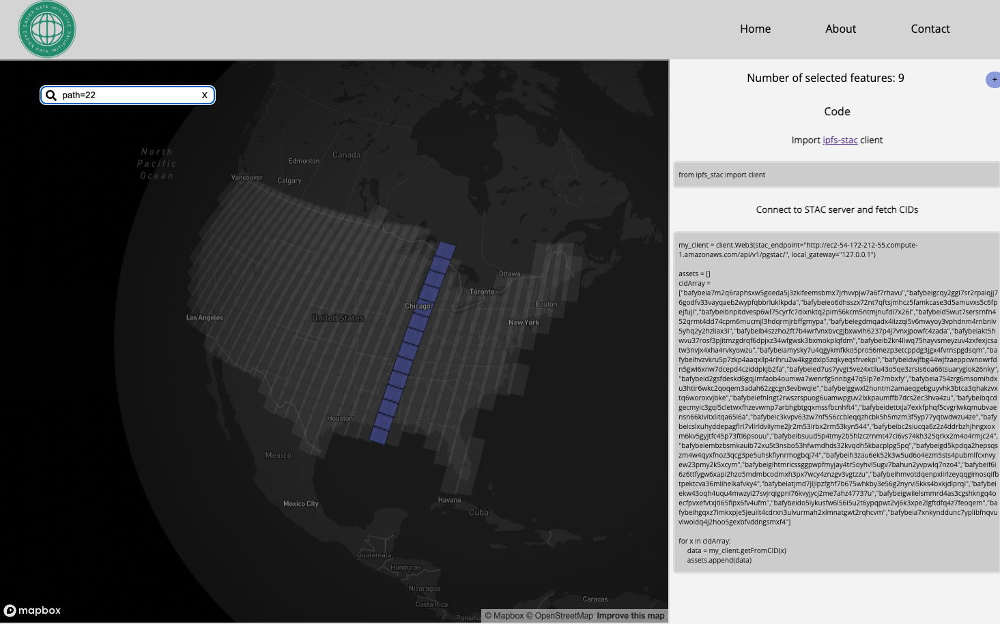
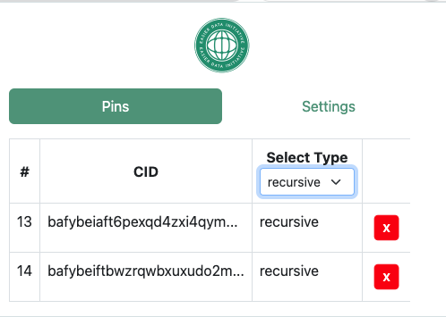

## Introduction

What does user access to geospatial data look like in Web3? How can they find data or download content? Spoiler alert! Not much different than today but with the advantages of a decentralized network. One of the projects currently being fostered by The EASIER Data Initiative has been focused on user accessibility of decentralized content with a Web3 Geospatial Dashboard application and a Chrome extension. The dashboard is the entry point for a user to discover content, specifically [Landsat 9 Collection 2 Level-1 imagery](https://www.usgs.gov/landsat-missions/landsat-collection-2-level-2-science-products). With the Chrome extension enabled, a user is able to "pin" an image from our implementation of the [SpatioTemporal Asset Catalogs](https://stacspec.org/en) (STAC) running alongside our IPFS node. Let's dive into the details of our Web3 implementation.

## Architecture

The data showcased by our dashboard all stem from NASA's Landsat 9 earth observation. The satellite imagery and metadata utilized by the dashboard is stored on AWS S3 buckets managed by the University of Maryland. This data is interfaced and traversable through spatial-temporal-asset-catalogs (STAC catalogs) APIs allowing subsets of data to be explored and extracted.

With the STAC API and imagery, the EASIER Data Initiative has pinned assets from the continental United States to IPFS and has partnered with a storage provider (PikNik) to store the imagery within Filecoin deals. This fueled the generation of a web3 enriched GeoJSON manifest that links both the Geospatial metadata with the Web3 metadata (CIDs, piece CIDs, and more) in a dictionary-like format. This GeoJSON is hosted on Mapbox.

The dashboard's user-facing interface is developed with Svelte and employs Mapbox to fetch and render Landsat 9 tilesets denoted within the aforementioned web3 enriched GeoJSON. For more utility, a complementary chrome extension enables seamless IPFS interaction with the dashboard and unlocks features such as data pinning and on-the-fly IPFS metadata fetching.

## Feature 1 - Popup

All rendered tiles are equipped with an click event handler that renders a popup that list high level metadata associated with the correlated Landsat 9 asset (currently Solar Azimuth Angle). In addition to the metadata, additional buttons enable further exploration.

The "Pin to local" button triggers a pin API call to the node configured with the dashboard's chrome extension which in turn makes the data more accessible and more redundant within the IPFS ecosystem. The "Fetch from cold storage" button is a feature that is a work in progress which when done, will interact with a contract enabling users to unseal data from Filecoin. The "More" button will render a modal that enables users to download the scene and/or fetch the asset from IPFS within a Python program easily through copying and pasting the dynamic boilerplate code. The modal is shown below:

## Feature 2 - Pinning

As mentioned previously, all pop-ups will have a "Pin to local" button that sends API calls to the configured node. Upon clicking, a user will be able to check their IPFS desktop or run `ipfs pin ls | grep recursive` within a terminal to view the newly pinned CID.

## Feature 3 - Querying

Users can run structured queries which enables bulk exploration of tiles rendered by the dashboard. As of now, tiles are queryable through PATH and ROW as seen in the following examples

1. path=22
2. row=32
3. path=22,row=32

## Feature 4 - Multi Select

To further tackle the hassle of clicking tiles one by one to inspect information, users can hold their SHIFT key while drag-clicking to create a bounding box that selects multiple tiles. This will in turn bring up a side-bar analogous to the one displayed by querying.

## Chrome Extension

As hinted previously, the dashboard comes with a complementary Chrome extension which can be configured to an open node. Do note a few headers of the IPFS configuration need to be changed to accept requests from the Chrome extension and the Dashboard.

The Chrome extension plays a critical role within the project as it acts as a middleware that forwards API calls (such as Pinning) to the configured IPFS node. In addition, in its current state, the extension has features that enable the exploration and management of CIDs that are pinned.

## Conclusion

All things considered, the [Web3 Geospatial Dashboard](https://dashboard.easierdata.org/) highlights the seamless integration of decentralized technology (namely IPFS and Filecoin) to enable seamless exploration and data management with GIS systems. Shortly, the EASIER Data Initiative will roll out more features that are geared toward those more versed within the GIS space.
