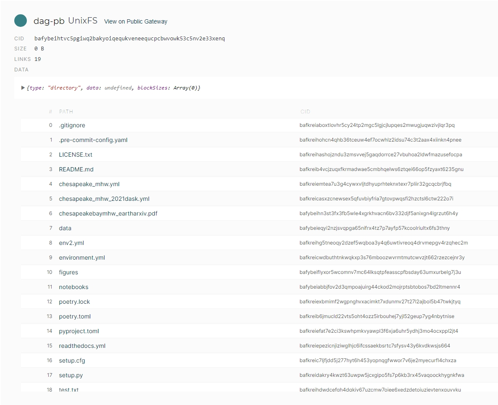

# Overview

The Chesapeake Bay, America's largest estuary, is experiencing a change in its waters. Marine heatwaves (MHWs), periods of unusually warm water temperatures, are becoming increasingly common in this vital ecosystem. Though MHWs have been extensively studied in open ocean environments, their behavior and impacts in complex estuarine systems remain less understood. A [study](https://eartharxiv.org/repository/view/8261/) by University of Maryland doctoral student, [Rachel Wegener](https://www.linkedin.com/in/rachelwegener/), has taken a novel approach to examining MHWs in the Chesapeake Bay by leveraging satellite data to analyze sea surface temperatures (SSTs).

The preservation of scientific knowledge, including studies like this, faces significant challenges in the digital age. Recent research has revealed that millions of scholarly articles are absent from major digital archives, putting vast amounts of [scientific information at risk of disappearing](https://www.nature.com/articles/d41586-024-03842-z). This issue extends beyond just preserving publications; it encompasses the need to safeguard a wide array of scholarly artifacts. These include raw data sets, experimental protocols, software code, and even the context in which research was conducted. The scientific community must consider not only the long-term accessibility of published findings but also the preservation of the entire research lifecycle, ensuring that future generations can fully understand, replicate, and build upon current scientific knowledge. Decentralized technologies offer a promising solution to these challenges by providing a distributed, permanent, and tamper-proof storage system for open scientific data and publications.

As we explore this study, consider all the scholarly artifacts generated throughout the [research lifecycle](https://researchsupport.harvard.edu/research-lifecycle). At the end we'll come back to how decentralized technologies can support preserving and sharing scientific knowledge open science research. For now, let's delve into the marine heatwaves in the Chesapeake Bay, starting with the monitoring network that makes such research possible.

## The Chesapeake Bay Program: A Vital Monitoring Network

The Chesapeake Bay Program maintains an extensive monitoring network that collects [crucial data](https://www.chesapeakebay.net/what/data) on various aspects of the Bay's ecosystem. This program involves multiple partners, including state and federal agencies, academic institutions, and over 30 scientists. Satellite data can be used to complement the in-situ measurements and offer several advantages:

1. Broad spatial coverage of the entire bay: The Chesapeake Bay Program's monitoring stations, while strategically placed, cannot cover every part of the 18,804 square kilometers of the Bay including tributaries.

2. High temporal resolution, allowing for daily measurements: Many monitoring stations collect data at fixed intervals, which may not capture the rapid onset or evolution of MHWs.

3. Consistent long-term records spanning multiple decades: Different monitoring stations may use varying equipment or measurement techniques, potentially introducing inconsistencies in long-term datasets.

By combining satellite data with in-situ measurements,  a more comprehensive picture of marine heatwaves in the Chesapeake Bay can be created.

## Satellite Datasets: Eyes in the Sky

Sea surface temperatures (SST) products are essential tools for understanding ocean dynamics, but their creation is a complex process. SST is [challenging](https://www.ghrsst.org/ghrsst-data-services/for-sst-data-users/products/#section5) to define precisely due to the upper ocean's variable vertical temperature structure, which is influenced by ocean turbulence and air-sea exchanges of heat, moisture, and momentum.

To address these challenges, scientists have developed sophisticated methods to derive SST from satellite observations. The process typically involves:

1. Data collection: Gathering temperature measurements from various satellites using both infrared and microwave sensors.

2. Multi-scale analysis: Combining data from different satellites using advanced techniques like Multi-Resolution Variational Analysis (MRVA).

3. Gap filling: Addressing missing data caused by clouds or gaps between satellite passes.

4. Bias correction: Adjusting satellite data using in-situ ocean measurements to improve accuracy.

5. High-resolution product generation: Creating daily, global sea surface temperature maps with resolutions as fine as 1 km.

This study utilizes two primary SST datasets, with a focus on the [Multi-scale Ultra-high Resolution (MUR) SST](https://eastcoast.coastwatch.noaa.gov/cw_podaac-mur_sst.php) product:

- [GHRSST Level 4 MUR Global Foundation Sea Surface Temperature Analysis](https://cmr.earthdata.nasa.gov/search/concepts/C1996881146-POCLOUD.html)

- [GHRSST Level 4 NOAA/OSPO Global Nighttime Sea Surface Foundation Temperature](https://cmr.earthdata.nasa.gov/search/concepts/C2036877745-POCLOUD.html)

These SST collections offer several key advantages. First, they provide daily global SST estimates at ultra-high resolutions (1 km for MUR, 5 km for NOAA/OSPO) with data availability dating back to 2002. Second, by integrating multiple satellite sensors, including both infrared and microwave instruments, they create cloud-free products through advanced data processing techniques. This approach enables the capture of fine-scale SST features, allowing for detailed analysis of phenomena like marine heatwaves in complex environments such as the Chesapeake Bay, where high spatial and temporal resolution is crucial for understanding local temperature dynamics.

## Characterizing Marine Heatwaves

Unlike heat waves that we experience on land, marine heat waves (MHW) have a longer lasting impact since water stores heat much longer than the atmosphere, persisting for weeks or months. National Oceanic and Atmospheric Administration (NOAA) defines a MHW event as water temperatures being warmer than 90% of the previous observations for a given time of year. The exact SST threshold for defining a MHW varies depending on the region but the intensity provides a more nuanced understanding of their impact on marine ecosystems and comparing events. This study characterizes MHWs as:

1. number of annual events
2. duration
3. maximum intensity
4. cumulative intensity
5. rate of onset
6. rate of decline

## Revealing Patterns in the Chesapeake Bay

Combining satellite data with in-situ measurements for validation reveals the following spatial and temporal patterns of MHWs in the Chesapeake Bay:

- Distinct patterns were observed in river-influenced areas, where MHW events appeared and extended to the main stem of the bay.
- The entire bay is experiencing an increased frequency of MHWs over time, with the upper bay showing the greatest increase.
- Seasonal variations in MHW occurrence and intensity, more so during the summer months.

Overall, satellite-derived MHW analysis is consistent with past buoy based analysis, demonstrating the utility of satellite data for monitoring and analyzing MHWs in estuarine environments like the Chesapeake Bay, where in-situ measurements may be limited. This also opens the door for the use of SST satellite data as an effective tool for monitoring and tracking MHWs, providing valuable information for resource managers and policymakers to mitigate the societal and economic impacts of these events on marine ecosystems.

## Preserving Scientific Knowledge with Decentralized Technologies

As we have explored this [study](https://eartharxiv.org/repository/view/8261/) on marine heatwaves in the Chesapeake Bay, it's clear that a wealth of scholarly artifacts are needed to support the research lifecycle. From raw satellite data to processed SST products, from analysis code to the final publication, each element contributes to the comprehensive understanding of this environmental phenomenon. Preserving these artifacts is crucial for the advancement of science and the ability of future researchers to build upon this work.

Decentralized web technologies offer promising solutions for preserving and sharing scientific knowledge in an open, accessible manner. Networks like the InterPlanetary File System (IPFS) and Filecoin provide distributed, permanent, and tamper-proof storage systems that can address many of the challenges faced in digital preservation of scholarly work.

## Implementing Decentralized Storage for Scientific Data

To demonstrate a practical application, we've published the source code from this study onto IPFS and Filecoin. Using the data onboarding tool, [Singularity](https://data-programs.gitbook.io/singularity), all the files found in our [repo](https://github.com/easierdata/chesapeake_mhw) were packaged into [Content Addressable Archives (CAR) files]((https://docs.filecoin.io/builder-cookbook/data-storage/store-data#prepare-data-for-filecoin-storage)). Since CAR files are content-addressable, the repository files can be easily retrieved and verified using the root Content Identifier (CID). To understand how this works, check out our previous post on [Using Content Addressable aRchives to store decentralized data](https://easierdata.org/updates/2024/2024-01-25-getting-to-know-content-addressable-archives).

let's go ahead and access the [source code](https://github.com/easierdata/chesapeake_mhw) via the root CID `bafybeihtvc5pgiwq2bakyoiqequkveneequcpcbwvowk53c5nv2e33xenq` on IPFS.

This CID uniquely identifies the entire repository, a verifiable snapshot of all the files. If we were to update the codebase or add new files, the CID would change, reflecting the modifications made to the repository. Yet, the original CID remains accessible, providing a permanent record of the research artifacts at that point in time.

> Note: There are mechanisms within the larger IPFS ecosystem like the [InterPlanetary Name System](https://docs.ipfs.tech/concepts/ipns/) (IPNS), enabling self-certifying mutable pointers to CIDs. In this example, we would use an IPNS name similarly to sharing a link to our repository.  Visiting the link would resolve to the CID representing the latest version of the repository, without any centralized authority controlling the resolution process.

Building upon these decentralized technologies, [DeSci Labs](https://desci.com) has developed a fully open science framework that leverages the power of decentralized systems. This framework aims to transform how scientific research is conducted, shared, and preserved throughout the entire research lifecycle.

One of the key innovations in DeSci Labs' approach is with [dPIDs (decentralized Persistent Identifier)](https://www.dpid.org/), drawing inspiration from the content addressing features of IPFS, which uses cryptographic hashes to uniquely identify and locate data across a distributed network. The dPID system takes this concept further by permanently registering these identifiers on a distributed ledger, ensuring long-term persistence and discoverability of scientific artifacts.

## Conclusion

Current systems often result in valuable research being locked behind paywalls, limiting access to those who can afford it and hindering the free flow of knowledge. These centralized models also incur significant costs related to ownership, maintenance, and access control. By embracing decentralized technologies, we can break down these barriers, ensuring that valuable research, such as the study highlighted here, remains openly accessible and verifiable for generations to come. This approach not only supports the principles of open science but also democratizes access to knowledge, reduces costs associated with traditional publishing models, and accelerates scientific progress by enabling researchers worldwide to freely build upon and extend existing work, regardless of their institutional affiliations or financial resources.
