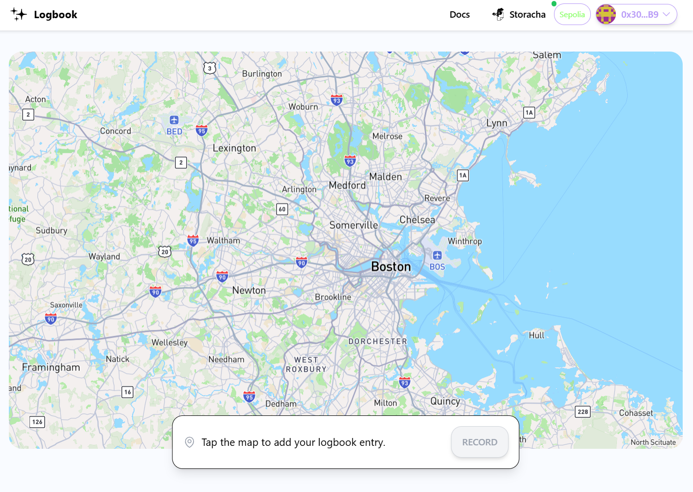
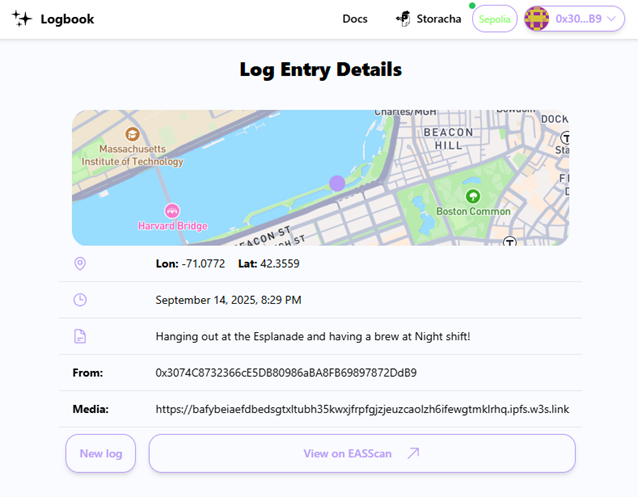
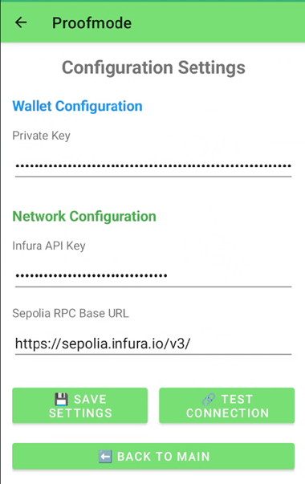
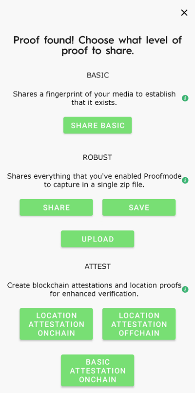
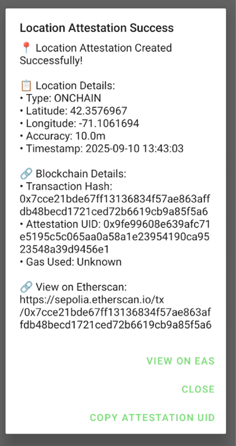
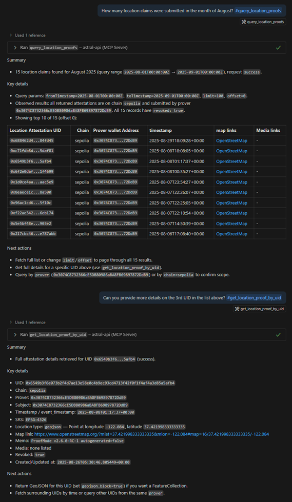
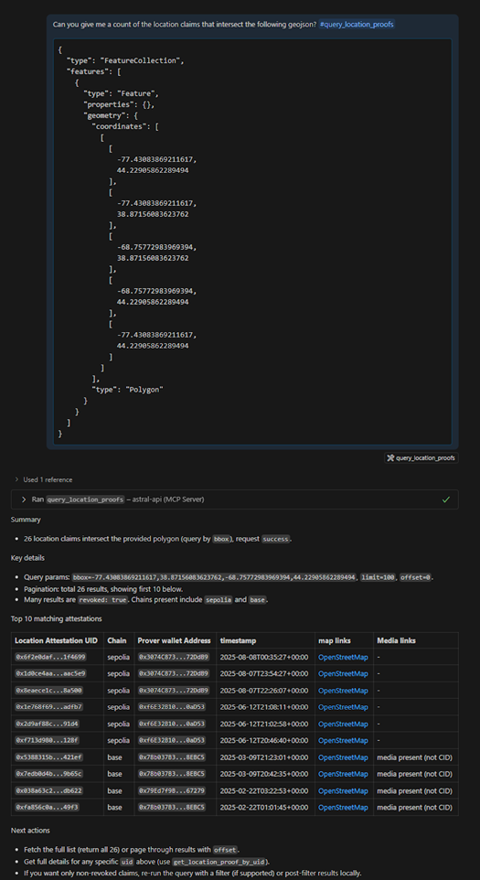

# Building Verifiable Location Data - Demonstrating the Location Protocol

Reliable digital location information is foundational to scientific research, news reporting, and many online services. Yet, traditional methods for sharing and verifying this data fall short. Too often, location records are easy to alter, hard to trace, and siloed within single apps. The location protocol is intended to close these gaps. It sets out a standard approach for recording, authenticating, and exchanging “location claims”—assertions linking events or observations to specific places.

An initial version of the Location **Protocol specification** is detailed below, including

- the motivation for the protocol,
- an outline of the core metadata model,
- how to use the protocol to record location-based records, and
- some demonstrations and potential real-world use-cases.

## What is the Location Protocol?

The [location protocol spec](https://spec.decentralizedgeo.org/) is designed to increase trust in location information by formalizing a simple yet powerful primitive: a location claim. These important digital artifacts define a format for apps and devices to represent spatial information that is secured through cryptographic signatures.

When location claims are used within decentralized environments, they inherit several key properties of the Web3 paradigm. Specifically, these claims become tamper-evident and independently verifiable through consensus, benefiting from decentralized trust models instead of relying on a single authority. The integrity, authenticity, and provenance of each claim can be validated by any participant, with all records anchored in a distributed ledger.

The remainder of this article will concentrate on the applications our team has been developing, with an emphasis on practical use cases of the location protocol. As you’ll see, when multiple applications and services are capable of reading and verifying location claims, they establish an interoperable foundation for trust. This shared methodology facilitates consistent verification and enhances confidence in location data across the entire ecosystem.

## 1. Astral Logbook

The [Astral Logbook](https://logbook.astral.global/) is akin to a daily journal for physical events. For example, the value of the Astral Logbook lies in its documentation: your entry isn’t just a story, it’s anchored to the actual places you were. Think of researchers, travelers, or field workers being able to say: “Yes, I collected this observation there.”

To use the Astral Logbook, users can connect their [web3 wallet](https://www.miniorange.com/blog/web3-authentication/) and then add an entry to the logbook. Selecting a location on the map opens up an entry form where users can attach media content, add some notes, and then submit.

<!-- 

  

 -->

Each submitted "location claim" becomes a [location attestation](https://spec.decentralizedgeo.org/introduction/core-concepts/#core-terminology), a cryptographic digital signature, that’s registered on-chain on the [Ethereum Attestation Service (EAS)](https://attest.org/). Once the submission is finalized and registered on EAS, your assertion of the “location claim” is recorded on the blockchain and can be verified by anyone. While the submission is being processed, any attached media content is uploaded and available on IPFS network along with persistent long-term storage provided by Filecoin. Here's a [link to my entry](https://logbook-8uihhlz0c-astralprotocol.vercel.app/attestation/uid/0x042d6a0675583c41f8425cffcd003371578fe824d819e384463cfca2327e8de9) on the Astral Logbook.

<!-- 

  

 -->

Here's the link to [my registered entry](https://sepolia.easscan.org/attestation/view/0x042d6a0675583c41f8425cffcd003371578fe824d819e384463cfca2327e8de9) which includes the photo I snapped while hanging out at one of Night Shift’s beer garden locations, conveniently uploaded to decentralized networks.

## 2. Proofmode Android App

Imagine witnessing a protest and needing to share trustworthy media. What about a home insurance claim in the wake of a natural disaster, and providing verifiable evidence of the damage? Or maybe you’re looking to prove to your friends that you were able to land that gnarly jump you’ve been working on all winter. That’s what [Proofmode](https://proofmode.org/) is designed for: proving the authenticity of pictures and videos.

At the moment of capture, ProofMode strengthens the media's verifiability by adding an extra layer of immutable metadata using the device's sensors, hardware fingerprinting, cryptographic signing, and third-party notaries. When that content circulates, this metadata serves as “proof” of the content, ensuring it hasn’t been tampered with or modified, which helps support the veracity of events at a particular time and place. This doesn’t solve misinformation overnight, but it creates a stronger chain of trust, especially for advocacy, reporting, or documentation in sensitive contexts.

We’ve been working closely with the [Guardian Project](https://guardianproject.info/) team by integrating the [Location Protocol](https://spec.decentralizedgeo.org/) into the [Proofmode Android app](https://gitlab.com/SethDocherty/proofmode-android/-/tree/nodejs-integration?ref_type=heads). Users can now assert verifiable evidence of the location data associated with the generated proofs onto the blockchain, and the proofs themselves are published and decentrally stored on IPFS, ensuring data integrity and immutability.

As part of the development effort, we extended the settings menu to let users add their existing wallet IDs, enabling them to submit attestations to EAS. We are currently working on adding support for Privy and streamlining wallet authentication, particularly for new users, to enable them to create wallets and log in using their email or phone number.

<!-- 

  

 -->

Depending on the need and use case, users have an array of proof options that can be enabled within the settings menu. The more options enabled, the more robust the proof metadata will be. In order to create location attestations in the app, the “location” option must be enabled in this menu.

Proofs within the Proofmode app are created by either importing existing media from the gallery or taking a picture within the app, and can then be shared with others. Users have several sharing options to choose from, but if the proofs include the locational component in proof generation, they can create on-chain or off-chain location attestations. Selecting the on-chain option submits it to EAS linked to you through your wallet ID. The off-chain option saves the location attestation payload to a JSON file, giving users the option of where and how to submit, whether that’s through another blockchain solution, a decentralized network, or even a private database.

<!-- 

  
  

 -->

 

Once the submission is complete, users can view the [resulting location attestation](https://sepolia.easscan.org/attestation/view/0x9fe99608e639afc71e5195c5c065aa0a58a1e23954190ca9523548a39d9456e1) on EAS. From there, they can share this attestation, which serves as:

- An additional layer of validation, similar to a receipt, for the proof metadata.
- A reference to the CID of the proof itself, allowing retrieval from decentralized networks.
  
In many cases, the geospatial metadata is just as important as the visual evidence itself, but current systems for storing and verifying this data are often fragmented, insecure, or controlled by centralized providers. Our goal is to help improve Guardian Project's mission to build trust and boost digital resilience with censorship-resistant spatial data using the location protocol specification

## 3. Astral MCP Agent

The [Model Context Protocol](https://www.anthropic.com/news/model-context-protocol), or MCP for short, serves as a universal adaptor that lets AI assistants work with data, tools, and services in a predictable and organized way. APIs are best suited for the protocol because MCP’s standardized framework exposes APIs as an accessible “plug and play” interface without the need for building custom integrations or connections. By wrapping the [Astral API](https://docs.astral.global/api/getting-started) into an MCP agent, users can query location protocol-compliant attestations made across multiple blockchains using natural language, providing a more intuitive experience for exploration and data analytics.

The [Astral MCP agent](https://github.com/DecentralizedGeo/astral-api-mcp) makes it easier to ask meaningful questions and receive reliable answers about where things happen, such as:
Searching the blockchain for location claims by place, type, or date, just by using everyday questions.
Analytical work, such as generating maps or analyzing trends in location data, becomes much easier and can even be automated.

Here’s a glimpse of how developers and researchers can explore live attestation data through familiar AI tools, instead of writing custom programs.

<!-- 

  
  

 -->

 

Want to try it out for yourself? Import our [python package](https://pypi.org/project/astral-mcp-server/) as an [MCP agent in VSCode](https://code.visualstudio.com/docs/copilot/customization/mcp-servers?originUrl=%2Fdocs%2Fcopilot%2Fcustomization%2Fmcp-servers) and check out our [guide](https://github.com/DecentralizedGeo/astral-api-mcp/blob/main/docs/mcp-tools-guide.md) for more details on the available tools and example prompts to test!

## Wrapping up

Verification is tough, and misinformation isn’t going away anytime soon. However, the location protocol specification is designed to provide a practical way to incorporate truth into our media. By capturing and sharing location claims at the moment content is created, apps like the Astral Logbook, ProofMode, and Astral MCP agent show us how trust can be built into the digital ecosystem from the ground up.
